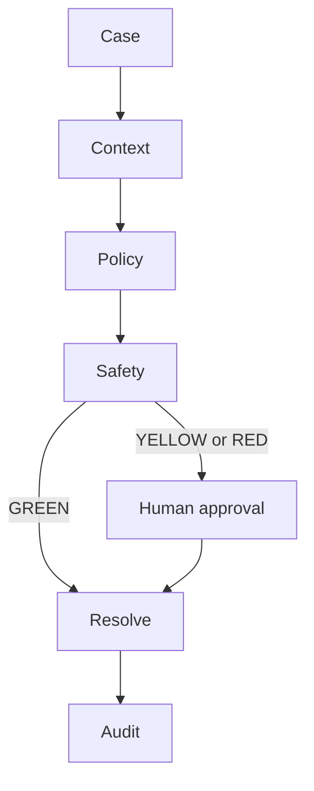
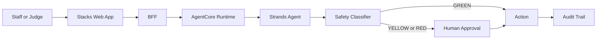

# Stacks

### Your systems handle the routine. Stacks works what they leave behind.

A task-completion agent for library operations, built with the Strands Agents SDK and deployed on Amazon Bedrock AgentCore.

[](LICENSE)
[](https://strandsagents.com/)
[](https://aws.amazon.com/bedrock/agentcore/)

## Try Stacks

**Live demo: https://main.d1f4dnxaaugevn.amplifyapp.com/**

Open the site, click **Sign In**, choose the **Hackathon Judges** tab, then **Continue as Hackathon Judge**. One click, no password, full real permissions against the real deployed AWS backend. No credentials ever leave the server.

**Demo environment, synthetic library workflow data.** The infrastructure and agent execution are real (real Cognito, real DynamoDB, real Bedrock AgentCore Runtime, real AgentCore Memory, real Bedrock Guardrails). The room bookings, ILL requests, and patron records the demo runs against are a seeded synthetic dataset, not a real library's live data.

---

## What is Stacks?

Stacks works the exception queue that traditional library automation creates and then hands back to staff.



It handles three real workflows end to end:

- **Room-booking conflicts**: resolves them against a library's stated priority policy
- **Ambiguous interlibrary-loan requests**: a dedicated specialist agent narrows down multiple candidate editions
- **Overdue-item escalation**: a durable, multi-day escalation sequence that stays context-aware of patron circumstance

It resolves the cases it can safely resolve, prepares the ones that need a second opinion, and stops for a human exactly when judgment is required.

## The problem

Libraries already have mature automation for predictable work: LibCal blocks an obviously double-booked slot, ILLiad auto-routes the routine borrow, an ILS fires a templated overdue notice on a fixed schedule. What none of that automation does is resolve the conflict that occurs anyway, route the genuinely ambiguous request, or differentiate an overdue response by patron circumstance. That remainder becomes a human review queue, at exactly the point where library staff have the least capacity to absorb it.

A concrete case: an interlibrary-loan request comes in for a title with two different editions available and no indication which one the patron wants. Existing systems can detect that ambiguity. They can't resolve it. Stacks does.

## Who it's for

Branch managers, circulation staff, room-booking staff, and ILL coordinators: the people who manage operational exceptions once existing library systems have already flagged them.

## What Stacks does differently

**Traditional automation:** Detect, Rule, Route, Human queue.

**Stacks:** Case, Context, Policy, Specialist, Safety, then Resolve or human approval.

Stacks targets a different part of the workflow: the ambiguous exception case that traditional automation sends back to staff, not the deterministic routing traditional automation already does well.

**Agent, not chatbot.** A chatbot answers a question. Stacks decides, acts, and produces an outcome. Chatbot: Question, then Answer. Stacks: Case, Decision, Action, Outcome.

## Human in the loop, by design

Every action is classified **GREEN**, **YELLOW**, or **RED**:

- **GREEN**: safe to automate, resolved without a human
- **YELLOW**: prepared and correct, waiting for a staff member to confirm
- **RED**: a human makes the decision, not the agent

**The model never decides its own safety tier.** The classifier is a plain, code-governed function, not a prompt, so the agent cannot reason its way into skipping a human. Stacks evaluates each case against the library's own written policy and records the exact clause the decision cites. Every meaningful action is written to a durable audit trail: the case, the action taken, its tier, the result, and when it happened.

AgentCore Memory lets Stacks recall relevant prior context across sessions, a requester's past substitution pattern, a documented patron hardship flag, so a decision made today is informed by what actually happened before, not a blank slate every time.

## Judge quick start

1. Open the live demo, click **Sign In**, then **Continue as Hackathon Judge**
2. Open **Approval Inbox** and review a pending case, including the policy clause it cites
3. Approve it, then open **Audit Trail** to see the recorded action
4. Try the **ILL Queue**: submit a new request and watch it route or escalate
5. Try the **Overdue Queue** and **Calendar** views for the other two workflows

A judge should never need curl, the AWS CLI, or any developer tooling to experience the product. The hosted demo is the primary way to try Stacks.

## Built on AWS

| Service | Role |
|---|---|
| Amazon Bedrock | Foundation model inference (Amazon Nova Lite) |
| Bedrock AgentCore Runtime | Hosts and executes the agent |
| AgentCore Memory | Cross-session contextual recall |
| Bedrock Guardrails | Output content safety |
| Amazon Cognito | Staff authentication and role groups |
| Amazon DynamoDB | Operational state and the audit trail |
| Amazon S3 | Agent session state |
| Amazon EventBridge | Scheduled nightly overdue processing |
| AWS Lambda | BFF compute and the EventBridge-to-runtime shim |
| AWS Amplify Hosting | The staff web application |

## How it works



## Security boundaries

Cognito-verified identity on every request, tenant-scoped identity, role-based permissions enforced server-side rather than only hidden in the UI, the GREEN/YELLOW/RED safety tier enforced in code rather than by the model, and a durable audit trail of every mutating action.

## Repository layout

```
src/stacks/   the Strands agent, its domain tools, and the HITL classifier
bff/          the FastAPI backend the web app talks to
frontend/     the Next.js staff web application
infra/        Terraform for the real AWS infrastructure
tests/        unit, integration, and adversarial tests
docs/         product, architecture, evaluation, and research documentation
scripts/      provisioning and deployment scripts
```

## Run it locally

This project talks to real AWS services (Cognito, DynamoDB, Bedrock, AgentCore Runtime). There is no fully offline mode for the web app, though the unit test suite runs with no AWS credentials at all.

### Backend and agent tests, no AWS credentials needed

```bash
pip install -e ".[dev]"
pip install uvicorn
pytest tests/
```

### Running the BFF against real AWS

```bash
export STACKS_AWS_REGION=us-west-2
export STACKS_ENVIRONMENT=dev
export STACKS_COGNITO_USER_POOL_ID=<your Cognito user pool id>
export STACKS_COGNITO_APP_CLIENT_ID=<your Cognito app client id>
export STACKS_AGENT_RUNTIME_ARN=<your deployed AgentCore Runtime ARN>
python -m uvicorn bff.main:app --host 0.0.0.0 --port 8000
```

### Running the frontend

```bash
cd frontend
npm install
npm run dev
```

Set `NEXT_PUBLIC_BFF_BASE_URL` to point the frontend at the BFF above.

### Deploying the agent to a real AgentCore Runtime

```bash
python scripts/build_deployment_package.py
python scripts/upload_deployment_package.py
python scripts/update_agent_runtime.py
```

The real AWS infrastructure (DynamoDB tables, IAM roles, the EventBridge schedule, the Bedrock Guardrail) is defined in `infra/` as Terraform.

## Current limitations

- Runs against a synthetic library dataset, not a live catalog
- No live integration with OCLC/Tipasa, LibCal, or Alma yet
- Validated against synthetic test scenarios; pilot validation with practicing librarians is future work

## What's next

- Real OCLC/WorldShare and LibCal integrations
- Institution-specific policy configuration
- A real library pilot
- First-class, separately queryable approval audit events

## Built for Agents for Humans

Stacks was built for the [Agents for Humans Hackathon](https://agentsforhumans.devpost.com/) (Amazon Web Services, hosted on Devpost), in the **Good Neighbor Agents** track, using the Strands Agents SDK and AWS services.

## Author

**Yogesh Selvarajan**
[LinkedIn](https://www.linkedin.com/in/yogesh-selvarajan/) · [AWS Builder Center](https://builder.aws.com/community/@yogeshs)

## License

MIT, see [LICENSE](LICENSE).
