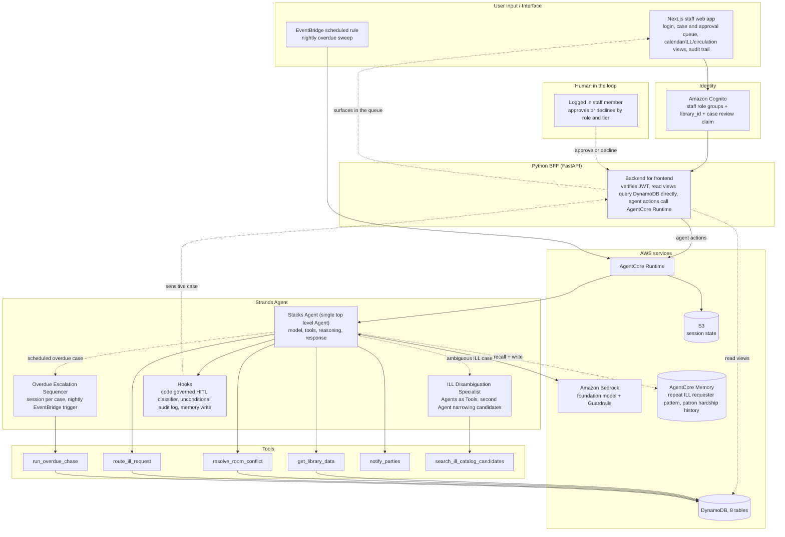

# Stacks

A task completion agent for library operations, built with the Strands Agents SDK and deployed on Amazon Bedrock AgentCore.

Entered in the [Agents for Humans Hackathon](https://agentsforhumans.devpost.com/), Good Neighbor Agents track.

## The problem

Libraries have already automated the easy, rule following part of room booking, interlibrary loan (ILL) requests, and overdue item chasing. The moment a case needs judgment instead of a fixed rule, it silently falls back to a human, right at the point where library staff have the least capacity to absorb it. A double booked community room, an ambiguous ILL request with two possible editions, an overdue notice that needs a different tone for a patron with a documented hardship flag: none of this is handled by the scheduling or circulation software libraries already run.

## Who it is for

Library staff, most directly a branch manager or circulation, room booking, and ILL coordinator staff, who currently resolve these judgment calls by hand, one case at a time, with no institutional memory carried between them.

## What Stacks does

Stacks is a real staff facing web application backed by a Strands agent system that:

- Resolves room booking conflicts against a stated priority policy
- Routes ambiguous interlibrary loan requests, including a dedicated ILL Disambiguation Specialist that narrows down multiple candidate editions
- Runs context aware overdue item chasing through a durable, multi day escalation sequence
- Keeps a human in the loop exactly when a case is sensitive or ambiguous enough to need one, gated by a code governed safety classifier, never a model's own judgment call
- Remembers real institutional context across sessions (a requester's past substitution pattern, a patron's hardship flag) using Amazon Bedrock AgentCore Memory
- Logs a full, durable audit trail of every action the agent takes, for the people supervising it

Why an agent instead of another rule engine: the same three workflows already have deterministic tooling (Springshare LibCal, OCLC ILLiad and Tipasa, standard ILS overdue modules). What none of that tooling does is resolve a conflict, narrow an ambiguous request, or differentiate a response by patron circumstance. That is exactly the judgment gap Stacks targets, with a human approving every sensitive decision rather than the agent acting alone.

## How it works



A full, kept up to date architecture writeup lives in [`docs/architecture/final_architecture.md`](docs/architecture/final_architecture.md), including the human in the loop safety classification table and the exact reasoning behind every AWS service used.

## Built on AWS

- Amazon Bedrock, foundation model inference (Amazon Nova Lite)
- Amazon Bedrock AgentCore Runtime, hosting the agent
- Amazon Bedrock AgentCore Memory, cross session institutional recall
- Amazon Bedrock Guardrails, output content safety
- Amazon Cognito, staff authentication and role groups
- Amazon DynamoDB, the library operations dataset and audit log
- Amazon S3, agent session state
- Amazon EventBridge, the nightly overdue sweep trigger
- AWS Lambda, the EventBridge to AgentCore Runtime shim

## Human in the loop, by design

Every action the agent takes is classified GREEN, YELLOW, or RED by a plain, code governed function, never by asking the model to judge its own case. GREEN commits on its own. YELLOW and RED pause and wait for a real staff member with the right role to approve, edit, or decline before anything happens. The classifier and the approval check are treated as the most safety critical code in the project and are covered by their own dedicated tests.

## Repository layout

```
src/stacks/          the agent, its tools, HITL classifier, memory, and identity code
bff/                  the FastAPI backend for frontend the web app talks to
frontend/             the Next.js staff web app
main.py               the AgentCore Runtime entrypoint
infra/                Terraform for the real AWS infrastructure
scripts/               one off provisioning and deployment scripts
tests/                 unit and integration tests
docs/                  the full research, architecture, product, and evaluation trail
```

## Running it locally

This project talks to real AWS services (Cognito, DynamoDB, Bedrock, AgentCore Runtime). There is no fully offline mode for the web app, though the unit test suite runs with no AWS credentials at all.

### Backend and agent tests, no AWS credentials needed

```bash
pip install -e ".[dev]"
pip install uvicorn
pytest tests/
```

### Running the BFF against real AWS

```bash
export STACKS_AWS_REGION=us-west-2
export STACKS_ENVIRONMENT=dev
export STACKS_COGNITO_USER_POOL_ID=<your Cognito user pool id>
export STACKS_COGNITO_APP_CLIENT_ID=<your Cognito app client id>
export STACKS_AGENT_RUNTIME_ARN=<your deployed AgentCore Runtime ARN>
python -m uvicorn bff.main:app --host 0.0.0.0 --port 8000
```

### Running the frontend

```bash
cd frontend
npm install
npm run dev
```

Set `NEXT_PUBLIC_BFF_BASE_URL` to point the frontend at the BFF above.

### Deploying the agent itself to a real AgentCore Runtime

```bash
python scripts/build_deployment_package.py
python scripts/upload_deployment_package.py
python scripts/update_agent_runtime.py
```

The real AWS infrastructure (DynamoDB tables, IAM roles, the EventBridge schedule, the Bedrock Guardrail) is defined in `infra/` as Terraform.

## Testing

The test suite covers unit tests for every tool and the HITL classifier, integration tests against a real Strands `Agent` instance, and a set of adversarial and prompt injection scenarios run against the real deployed model. Safety critical checks (does a sensitive case actually stop for a human, does the classifier ever fail open) have a zero tolerance bar, documented in `docs/evaluation/evaluation_plan.md`.

## License

MIT, see [LICENSE](LICENSE).

## Acknowledgments

Built with the [Strands Agents SDK](https://strandsagents.com/) for the Agents for Humans Hackathon, sponsored by AWS.
